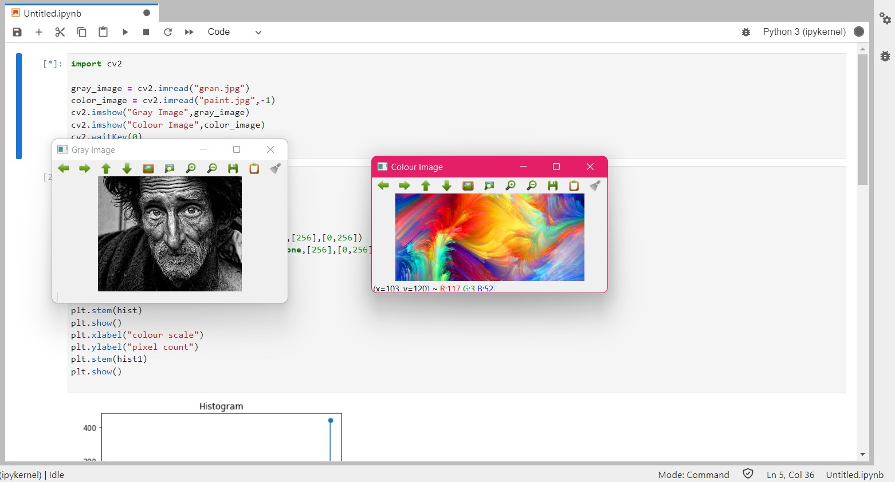
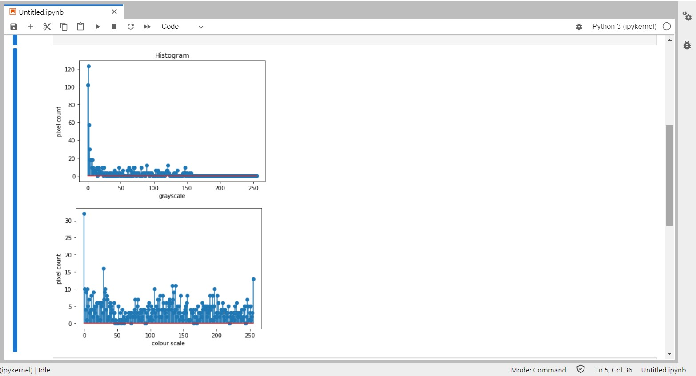
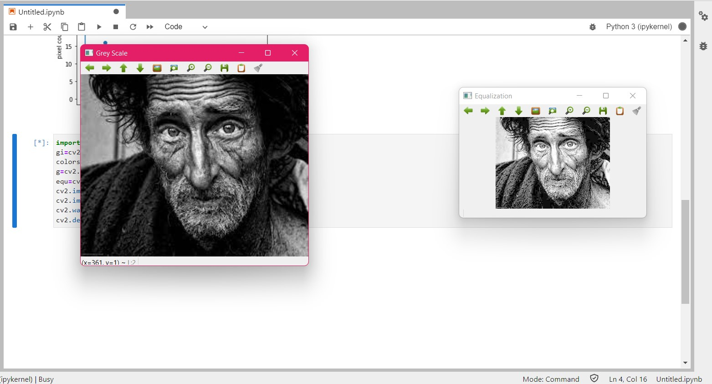

# Histogram and Histogram Equalization of an image
## Aim
To obtain a histogram for finding the frequency of pixels in an Image with pixel values ranging from 0 to 255. Also write the code using OpenCV to perform histogram equalization.

## Software Required:
Anaconda - Python 3.7

## Algorithm:
### Step1:
Import all the necessary libraries.
<br>

### Step2:
Read the images using imread() function.
<br>

### Step3:
Using calcHist() we can find the histogram of the images.
<br>

### Step4:
Using equalizeHist() we can equalize the image.
<br>

### Step5:
Using matplotlib.pyplot plot the histogram.

## Program:
```python
# Developed By: Kiran J
# Register Number: 212221240022

# Write your code to find the histogram of gray scale image and color image channels.

import cv2
import matplotlib.pyplot as plt

gray_image = cv2.imread("assemble.jpg")
color_image = cv2.imread("pink.jpg",-1)
cv2.imshow("Gray Image",gray_image)
cv2.imshow("Colour Image",color_image)
cv2.waitKey(0)
cv2.destroyAllWindows()

# Display the histogram of gray scale image and any one channel histogram from color image

import cv2
import matplotlib.pyplot as plt

grayscale_image=cv2.imread("assemble.jpg")
colourscale_image=cv2.imread("pink.jpg")
hist=cv2.calcHist(grayscale_image,[0],None,[256],[0,256])
hist1=cv2.calcHist(colourscale_image,[1],None,[256],[0,256])
plt.figure()
plt.title("Histogram")
plt.xlabel("grayscale")
plt.ylabel("pixel count")
plt.stem(hist)
plt.show()
plt.xlabel("colour scale")
plt.ylabel("pixel count")
plt.stem(hist1)
plt.show()


# Write the code to perform histogram equalization of the image. 

import cv2
gi=cv2.imread("assemble.jpg",0)
colorscale=cv2.imread("pink.jpg")
g=cv2.resize(greyscale,(500,400))
equ=cv2.equalizeHist(gi)
cv2.imshow("Grey Scale",g)
cv2.imshow("Equalization",equ)
cv2.waitKey(0)
cv2.destroyAllWindows()

```
## Output:
### Input Grayscale Image and Color Image

<br>
<br>
<br>
<br>

### Histogram of Grayscale Image and any channel of Color Image

<br>
<br>
<br>
<br>

### Histogram Equalization of Grayscale Image

<br>
<br>
<br>
<br>

## Result: 
Thus the histogram for finding the frequency of pixels in an image with pixel values ranging from 0 to 255 is obtained. Also,histogram equalization is done for the gray scale image using OpenCV.
